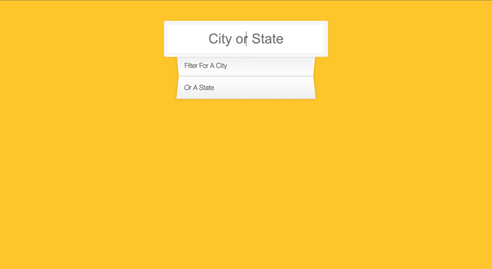
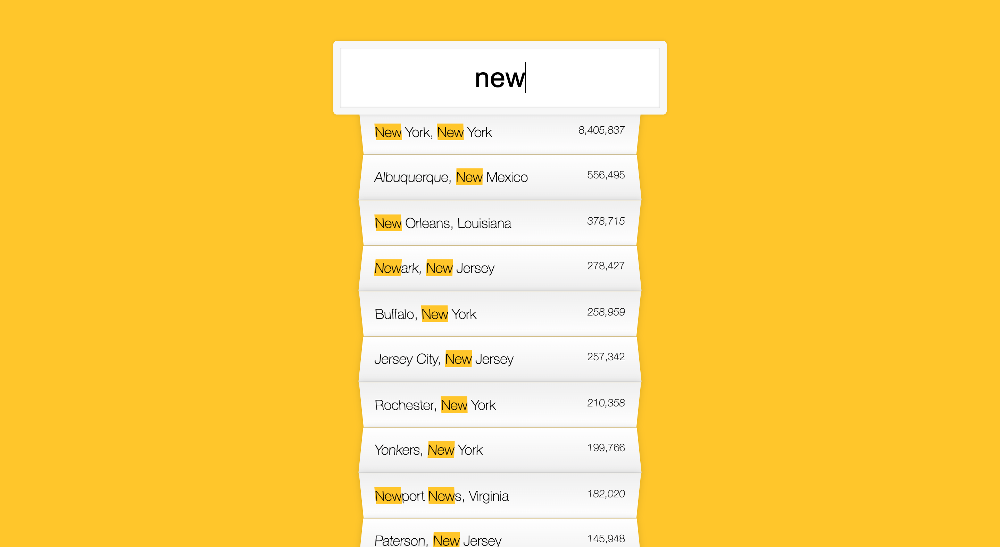
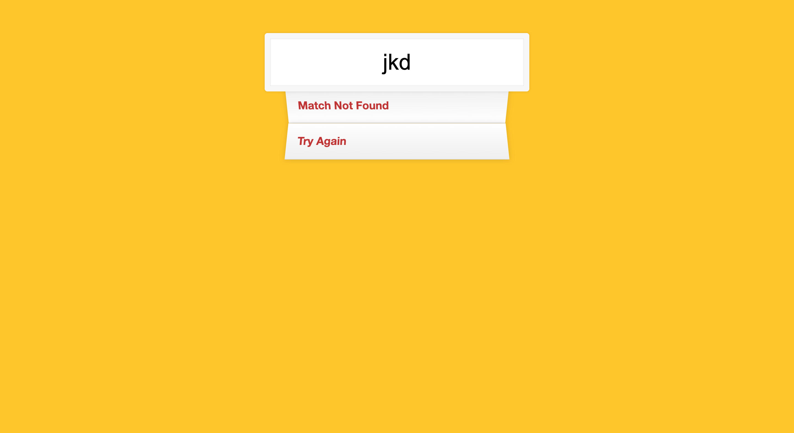

# US City Population

US City Population is a website that helps you search for population of US cities.

## Table of contents

- [Overview](#overview)
  - [Screenshots](#screenshots)
  - [Demo Link](#demo-link)
- [About the Project](#about-the-project)
  - [Status](#status)
  - [Built with](#built-with)
  - [Reflection](#reflection)
- [Author](#author)

## Overview

### Screenshots





### Demo Link

**[💻 Live Site URL](https://soojeong-park-ca.github.io/us-city-population/)**

## About the Project

### Status

✅ Completed & Deployed

### Built with

- HTML
- CSS
- Vanilla JS

### Reflection

This was another Vanilla JS project from JavaScript 30 course by Wes Bos using GitHub gist from [1000 Largest US Cities By Population With Geographic Coordinates, in JSON](https://gist.github.com/Miserlou/c5cd8364bf9b2420bb29).

Some features to highlight in this project are:

- using `async/await function` to fetch data.

  ```js
  // Fetch API data
  async function fetchData(searchQuery) {
    const res = await fetch(endpoint);
    const data = await res.json();
    if (!res.ok) {
      throw Error(res.statusText);
    }

    const neededData = await data.map(item => ({
      city: item.city,
      state: item.state,
      population: item.population,
    }));

    apiData.push(...neededData);
  }
  fetchData();
  ```

- using `RegExp()` constructor to create a regular expression to match input value with the fetched data.

  ```js
  // Find matching words
  function findMatches(wordToMatch, apiData) {
    const regex = new RegExp(wordToMatch, "gi");
    return apiData.filter(
      item => item.city.match(regex) || item.state.match(regex)
    );
  }
  ```

- using `innerHTML` property to change the HTML content of element.

One of the challenges I faced as I was building this app was using regular expressions. Initially, when I was building the app on my own, I tried to make a complex logic to try to match the input value with the fetched data. However, after listening to the lecture, I realized that all of that process becomes so much simpler and cleaner to code when I use RegExp.

## Author

Soojeong Park [@codingsooj](https://twitter.com/codingsooj)
